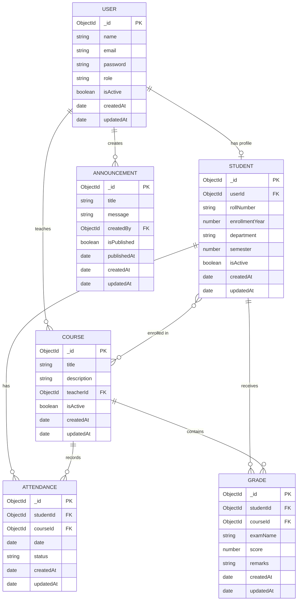
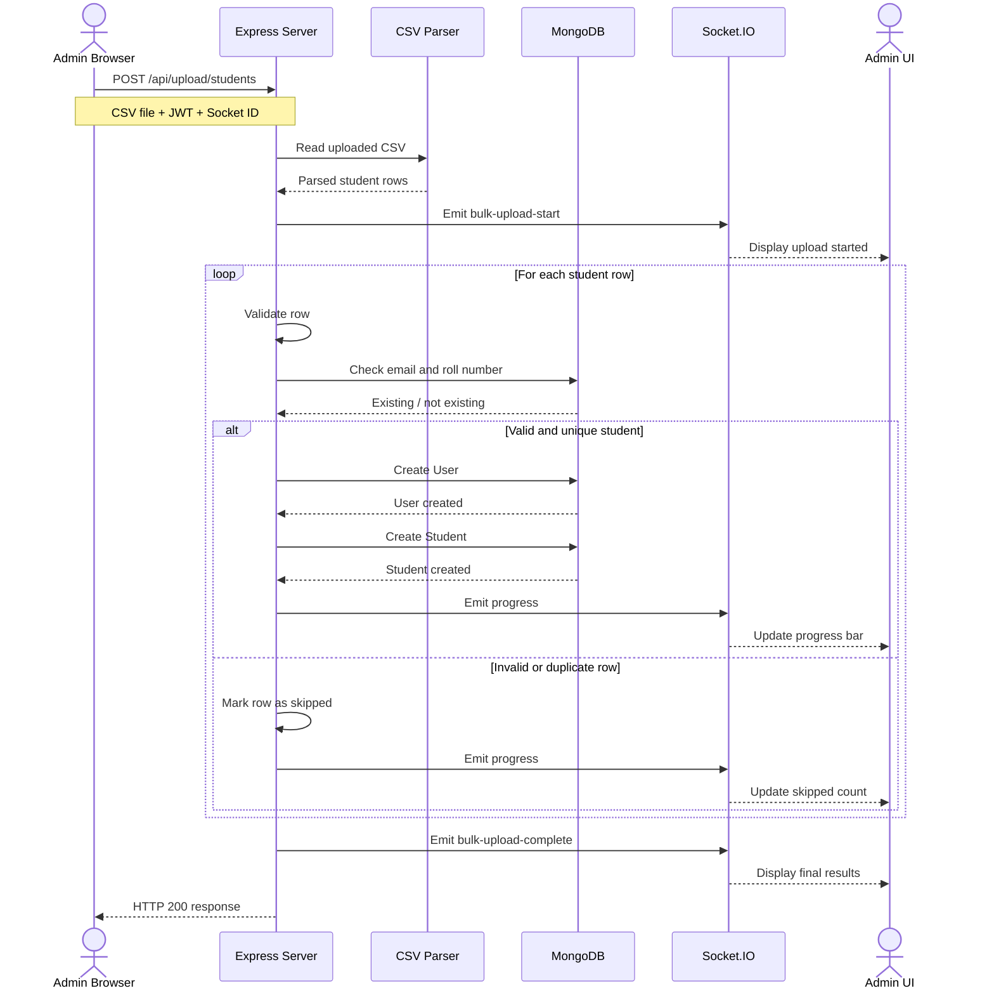

# School Management ERP

A full-stack School Management Enterprise Resource Planning (ERP) system built using Node.js, Express.js, MongoDB, EJS, JWT authentication, Socket.IO, Chart.js, PDFKit, and CSV processing.

The system provides role-based access for Administrators, Teachers, and Students while supporting attendance management, course management, grading, report cards, analytics, bulk student uploads, CSV exports, PDF reports, and real-time announcements.

---

## 1. Features

### Authentication and Authorization

* JWT-based authentication
* Password hashing using bcrypt
* Role-Based Access Control (RBAC)
* Attribute-Based Access Control (ABAC)
* Three user roles:

  * Admin
  * Teacher
  * Student
* Active/inactive user accounts
* Protected API routes

### Admin Features

* Admin dashboard
* View school-wide analytics
* Create courses
* Assign teachers to courses
* Enroll students into courses
* View course information
* Bulk upload students using CSV
* Real-time CSV upload progress
* Publish real-time announcements
* Export attendance reports
* View student report cards

### Teacher Features

* Teacher dashboard
* View assigned courses
* View enrolled students
* Mark attendance
* Use Present / Absent / Late attendance statuses
* Upload grades for assigned courses
* View course grades
* Export attendance reports
* Receive real-time announcements

### Student Features

* Student dashboard
* View enrolled courses
* View personal attendance
* View attendance percentage
* View personal report card
* View recent examination scores
* Download report card as PDF
* Receive real-time announcements

### Analytics

* Total active students
* Total courses
* School-wide attendance percentage
* Attendance breakdown
* Teacher passing rate
* Average grades
* Student attendance percentage
* Recent examination score chart

### File Processing

* Bulk student CSV upload
* CSV validation
* Duplicate email detection
* Duplicate roll-number detection
* CSV attendance export
* PDF report card generation

### Real-Time Features

* Socket.IO integration
* Real-time CSV upload progress
* Real-time school announcements
* Live updates without refreshing the page

---

## 2. Technology Stack

### Backend

* Node.js
* Express.js
* MongoDB
* Mongoose
* JWT
* bcryptjs
* Socket.IO

### Frontend

* EJS
* HTML5
* CSS3
* JavaScript
* Chart.js

### File Processing

* csv-parser
* json2csv
* PDFKit
* Multer

### Security

* Helmet
* CORS
* Express Rate Limit
* Express Mongo Sanitize
* dotenv

### Documentation

* Mermaid.js

---

## 3. Database Design

The ERP uses MongoDB with Mongoose models.

Main collections:

* User
* Student
* Course
* Attendance
* Grade
* Announcement

### Relationships

* A User can have a Student profile.
* A User can teach multiple Courses.
* A Student can enroll in multiple Courses.
* A Course can contain multiple Students.
* A Student can have multiple Attendance records.
* A Course can have multiple Attendance records.
* A Student can receive multiple Grades.
* A Course can contain multiple Grades.
* A User can create multiple Announcements.

---

## 4. Entity Relationship Diagram

The following ERD was created using Mermaid.js.



---

## 5. WebSocket Bulk Upload Sequence Diagram

The bulk student upload process uses HTTP for the file upload and Socket.IO for real-time progress updates.



---

## 6. Project Structure

```text
school-management-erp/
│
├── controllers/
│   ├── announcementController.js
│   ├── attendanceController.js
│   ├── bulkUploadController.js
│   ├── courseController.js
│   ├── dashboardController.js
│   └── gradeController.js
│
├── docs/
│   ├── erd.md
│   └── sequence-diagram.md
│
├── middleware/
│   ├── authMiddleware.js
│   └── roleMiddleware.js
│
├── models/
│   ├── Announcement.js
│   ├── Attendance.js
│   ├── Course.js
│   ├── Grade.js
│   ├── Student.js
│   └── user.js
│
├── public/
│   └── js/
│       ├── admin-bulk-upload.js
│       ├── announcements.js
│       ├── dashboards.js
│       ├── login.js
│       ├── report-card.js
│       └── take-attendance.js
│
├── routes/
│   ├── announcementRoutes.js
│   ├── attendanceRoutes.js
│   ├── authRoutes.js
│   ├── bulkUploadRoutes.js
│   ├── courseRoutes.js
│   ├── dashboardRoutes.js
│   ├── gradeRoutes.js
│   ├── pageRoutes.js
│   └── testRoutes.js
│
├── uploads/
│
├── validations/
│
├── views/
│   ├── admin-bulk-upload.ejs
│   ├── admin-dashboard.ejs
│   ├── announcements.ejs
│   ├── login.ejs
│   ├── report-card.ejs
│   ├── student-dashboard.ejs
│   ├── take-attendance.ejs
│   └── teacher-dashboard.ejs
│
├── .env
├── .env.example
├── .gitignore
├── package.json
├── seed.js
└── server.js
```

---

## 7. Prerequisites

Install the following before running the project:

* Node.js
* npm
* MongoDB Atlas account or local MongoDB installation
* Git

Recommended Node.js version:

```text
Node.js 20+
```

---

## 8. Environment Variables

Create a `.env` file in the project root.

Example:

```env
PORT=3000

MONGO_URI=your_mongodb_connection_string

JWT_SECRET=your_jwt_secret

FRONTEND_URL=http://localhost:3000
```

Never commit the actual `.env` file containing private credentials.

The `.env.example` file should contain placeholder values only.

---

## 9. Installation

Clone the repository and enter the project directory.

Install dependencies:

```bash
npm install
```

---

## 10. Database Configuration

Configure the MongoDB connection string in `.env`:

```env
MONGO_URI=your_mongodb_connection_string
```

The application connects to MongoDB when the server starts.

---

## 11. Create the Initial Super Admin

The project includes a seed script for creating the initial administrator.

Run:

```bash
npm run seed
```

The seed script creates the initial development administrator if one does not already exist.

Development seed account:

```text
Email: admin@schoolerp.com
Password: Admin@12345
Role: admin
```

For production use, the default development password should be changed.

Running the seed script again does not create a duplicate administrator.

---

## 12. Run the Application

### Development mode

```bash
npm run dev
```

### Production/start mode

```bash
npm start
```

The application runs by default at:

```text
http://localhost:3000
```

---

## 13. Available Pages

### Login

```text
GET /login
```

### Admin Dashboard

```text
GET /admin-dashboard
```

### Teacher Dashboard

```text
GET /teacher-dashboard
```

### Student Dashboard

```text
GET /student-dashboard
```

### Attendance

```text
GET /take-attendance
```

### Report Card

```text
GET /report-card
```

### Admin Bulk Upload

```text
GET /admin/bulk-upload
```

### Announcements

```text
GET /announcements
```

---

## 14. Main API Endpoints

### Authentication

```text
POST /api/auth/register
POST /api/auth/login
```

### Courses

```text
POST /api/courses
GET /api/courses
GET /api/courses/:courseId
```

### Attendance

```text
POST /api/attendance/:courseId

GET /api/attendance/course/:courseId

GET /api/attendance/student/my-attendance

GET /reports/attendance/:courseId/export
```

### Grades

```text
POST /api/grades/:courseId

GET /api/grades/course/:courseId

GET /api/grades/student/my-report-card

GET /api/grades/student/my-report-card/pdf

GET /api/grades/student/:studentId/report-card
```

### Dashboards

```text
GET /api/dashboard/admin

GET /api/dashboard/teacher

GET /api/dashboard/student
```

### Bulk Student Upload

```text
POST /api/upload/students
```

### Announcements

```text
GET /api/announcements

POST /api/announcements
```

---

## 15. Role-Based Access Control

### Admin

The administrator has complete access to school management functionality.

Admin capabilities include:

* Manage courses
* Assign teachers
* Enroll students
* View school analytics
* Upload students in bulk
* Publish announcements
* View reports
* Export attendance
* View report cards

### Teacher

Teachers can only operate on courses assigned to them.

Teacher capabilities include:

* View assigned courses
* View enrolled students
* Mark attendance
* Upload grades
* View grades for assigned courses
* Export attendance reports
* View announcements

Teachers cannot modify attendance or grades belonging to courses assigned to another teacher.

### Student

Students have access only to their own academic information.

Student capabilities include:

* View enrolled courses
* View personal attendance
* View personal attendance percentage
* View personal report card
* Download personal report card PDF
* View examination scores
* View announcements

---

## 16. Attendance System

Teachers select attendance for each enrolled student using:

* Present
* Absent
* Late

Attendance is submitted in bulk through the attendance interface.

Attendance records contain:

```text
studentId
courseId
date
status
```

The system also calculates attendance percentages for dashboards and reports.

---

## 17. Grade and Report Card System

Grades contain:

```text
studentId
courseId
examName
score
remarks
```

Students can view their personal report card through the ERP.

The system also generates a downloadable PDF report card using PDFKit.

---

## 18. CSV Attendance Export

Teachers and administrators can export attendance records using:

```text
GET /reports/attendance/:courseId/export
```

The exported CSV contains information including:

* Student name
* Student email
* Roll number
* Department
* Semester
* Course
* Date
* Attendance status

---

## 19. Bulk Student Upload

Administrators can upload multiple students using a CSV file.

Required CSV columns:

```text
name,email,password,rollNumber,enrollmentYear,department,semester
```

Example:

```csv
name,email,password,rollNumber,enrollmentYear,department,semester
Student One,student1@example.com,password123,STU001,2026,Computer Science,6
Student Two,student2@example.com,password123,STU002,2026,Computer Science,6
```

The system:

1. Receives the CSV file.
2. Parses the CSV.
3. Validates each row.
4. Checks for duplicate email addresses.
5. Checks for duplicate roll numbers.
6. Creates User records.
7. Creates Student records.
8. Reports imported and skipped records.
9. Emits real-time progress through Socket.IO.

---

## 20. Real-Time Announcements

Administrators can publish school announcements.

When an announcement is published:

1. The announcement is stored in MongoDB.
2. The server retrieves the populated announcement.
3. Socket.IO broadcasts the announcement.
4. Connected users receive the announcement immediately.
5. The announcement appears on the page without requiring a refresh.

---

## 21. Security Measures

The application includes several security mechanisms:

### Helmet

Provides HTTP security headers.

### CORS

Controls cross-origin requests.

### Rate Limiting

Limits excessive API requests.

### Mongo Sanitization

Helps prevent MongoDB operator injection.

### JWT

Protects authenticated API endpoints.

### bcrypt

Hashes user passwords before storing them.

### Role Middleware

Restricts endpoints according to user roles.

### ABAC

Checks ownership of resources, such as ensuring teachers can only modify their assigned courses.

### Environment Variables

Sensitive configuration is stored outside source code using `.env`.

---

## 22. Dashboard Analytics

### Admin Dashboard

Uses MongoDB aggregation to calculate:

* Active student count
* Total courses
* School-wide attendance
* Attendance distribution

### Teacher Dashboard

Displays:

* Assigned course count
* Passing rate
* Average score
* Course information

### Student Dashboard

Displays:

* Personal attendance percentage
* Enrolled courses
* Recent examination scores

Chart.js is used to visualize analytics.

---

## 23. Real-Time Architecture

Socket.IO is initialized on the HTTP server.

The server provides real-time communication for:

* Bulk upload progress
* Bulk upload completion
* New announcements

The client establishes a WebSocket connection and listens for server events.

---

## 24. Development Commands

Install dependencies:

```bash
npm install
```

Start development server:

```bash
npm run dev
```

Start application:

```bash
npm start
```

Create initial administrator:

```bash
npm run seed
```

---

## 25. Project Objective

The objective of this project is to implement a complete School Management ERP demonstrating:

* Relational-style database modeling using MongoDB references
* Authentication
* RBAC
* ABAC
* Course management
* Attendance management
* Grade management
* Report cards
* Dashboard analytics
* MongoDB aggregation
* CSV processing
* PDF generation
* Real-time WebSocket communication
* Real-time announcements
* Secure Express.js application design
* UML/system design documentation

---

## 26. Conclusion

The School Management ERP provides a centralized platform for managing students, teachers, courses, attendance, grades, reports, announcements, and school analytics.

The project combines a secure Express.js backend with MongoDB, an EJS-based frontend, real-time Socket.IO communication, Chart.js analytics, CSV processing, and PDF report generation.

The system demonstrates role-specific access control and resource ownership checks to ensure that administrators, teachers, and students can only perform actions appropriate to their responsibilities.
